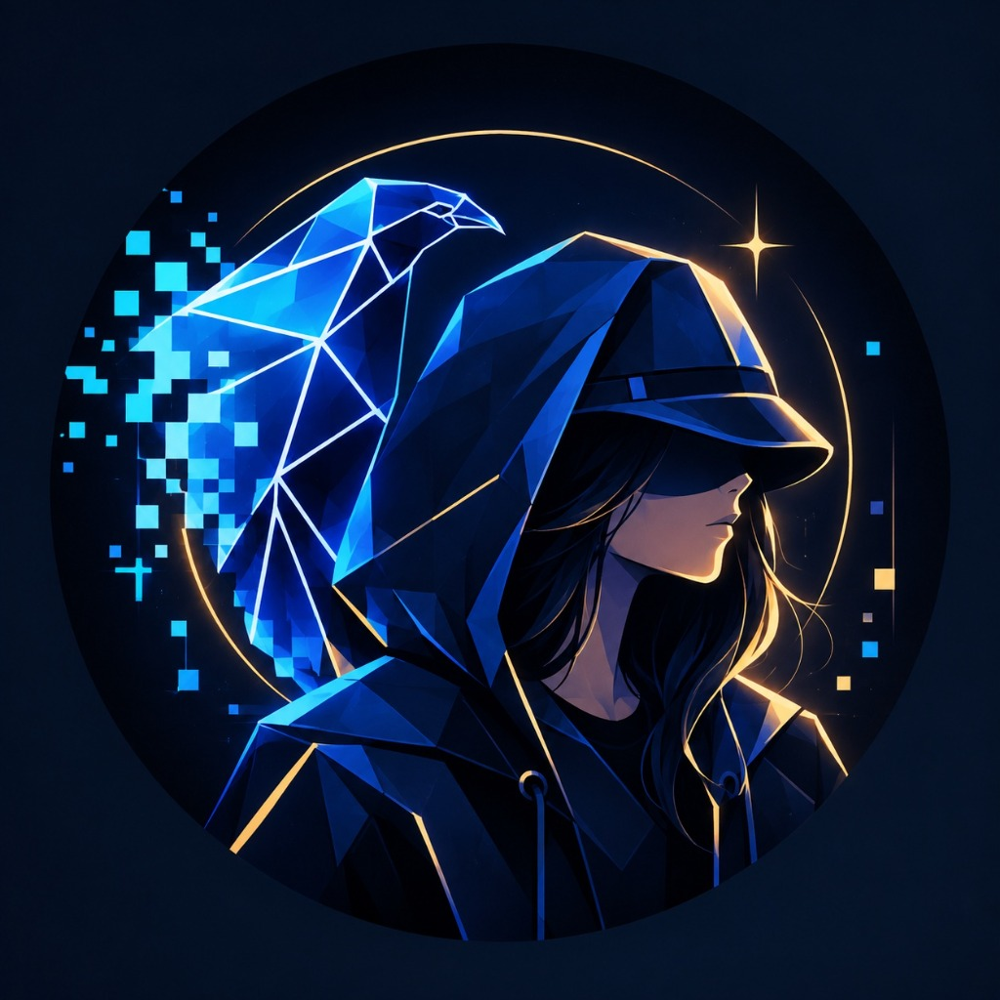
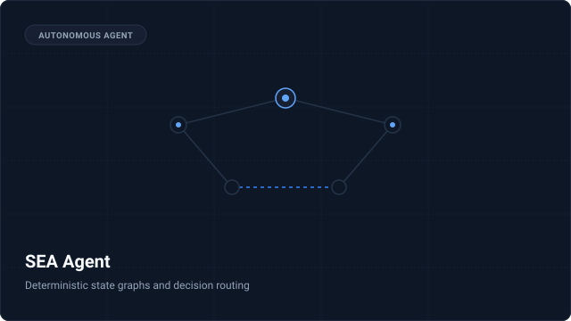
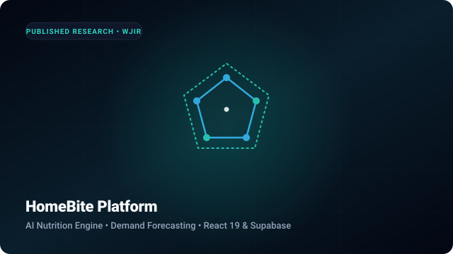
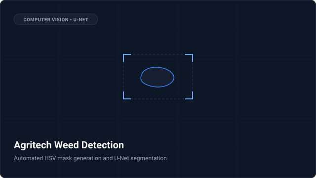
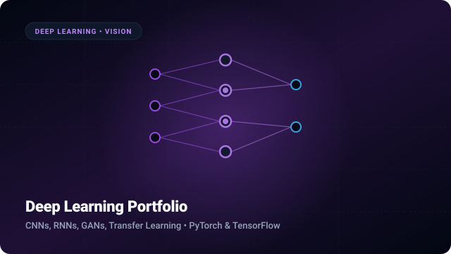
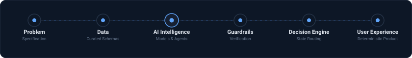
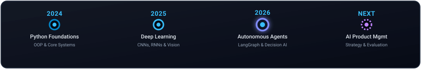

<!-- ======================================================== -->
<!-- GAURI SHINDE | AI ENGINEER & ASPIRING AI PRODUCT MANAGER -->
<!-- THEME: CYBER MINIMAL • SUBTLE BLUE ACCENTS • DARK NAVY   -->
<!-- ======================================================== -->

<!-- HERO SECTION -->
<table width="100%" border="0" cellpadding="0" cellspacing="0" style="width: 100%; border: none; border-collapse: collapse; margin-bottom: 36px;">
  <tr style="border: none; background: transparent;">
    <td width="145" align="center" valign="middle" style="border: none; padding: 6px 24px 6px 0;">
      
    </td>
    <td valign="middle" style="border: none; padding: 6px 0;">
      <h1 style="margin: 0; font-size: 2.6rem; font-weight: 800; letter-spacing: -0.5px; color: #FFFFFF; line-height: 1.1;">
        GAURI SHINDE
      </h1>
      

        AI Engineer &nbsp;•&nbsp; Autonomous Systems &nbsp;•&nbsp; Product Thinking
      

      

        Designing deterministic AI products that think, verify and decide.
      

      

        
        &nbsp;
        
        &nbsp;
        
        &nbsp;
        <a href="https://doi.org/10.31871/WJIR.20.4.15" target="_blank" style="vertical-align: top; display: inline-block; padding: 8px 14px; font-size: 12px; color: #94A3B8; text-decoration: none; border: 1px solid #253347; border-radius: 17px; background: #0D1726; font-family: -apple-system, BlinkMacSystemFont, 'Segoe UI', Roboto, sans-serif; font-weight: 500;">
          Paper (WJIR) ↗
        </a>
      

    </td>
  </tr>
</table>

<!-- CURRENTLY BUILDING -->
<table width="100%" border="0" cellpadding="0" cellspacing="0" style="width: 100%; border-collapse: separate; border: 1px solid #1E293B; background: #0D1726; border-radius: 12px; margin-top: 36px; margin-bottom: 36px;">
  <tr>
    <td style="padding: 24px 28px; border: none;">
      

        CURRENTLY BUILDING
      

      <h2 style="margin: 0 0 14px 0; font-size: 1.5rem; font-weight: 700; color: #FFFFFF;">
        Autonomous AI Decision Intelligence
      </h2>
      

        
        &nbsp;
        
        &nbsp;
        
        &nbsp;
        
        &nbsp;
        
        &nbsp;
        
      

      

        Building reliable AI workflows with deterministic state machines and product-first architecture.
      

    </td>
  </tr>
</table>

<!-- ABOUT ME -->
<h3 style="color: #CBD5E1; font-size: 1.15rem; margin-top: 36px; margin-bottom: 16px; letter-spacing: 0.5px;">
  ◈ About Me
</h3>

<table width="100%" border="0" cellpadding="0" cellspacing="0" style="width: 100%; border-collapse: separate; border-spacing: 12px; margin-left: -12px; margin-right: -12px; margin-bottom: 36px;">
  <tr>
    <td width="33.33%" valign="top" style="background: #0D1726; border: 1px solid #1E293B; border-radius: 12px; padding: 20px;">
      

        🧠 AI Engineering
      

      

        Multi-agent systems, computer vision, deep learning and reliable LLM pipelines.
      

    </td>
    <td width="33.33%" valign="top" style="background: #0D1726; border: 1px solid #1E293B; border-radius: 12px; padding: 20px;">
      

        📦 Product Thinking
      

      

        Transforming ML capabilities into scalable products with measurable business value.
      

    </td>
    <td width="33.33%" valign="top" style="background: #0D1726; border: 1px solid #1E293B; border-radius: 12px; padding: 20px;">
      

        🎯 Vision
      

      

        Privacy-first AI experiences designed for real-world decision making.
      

    </td>
  </tr>
</table>

<!-- FEATURED PROJECTS -->
<h3 style="color: #CBD5E1; font-size: 1.15rem; margin-top: 36px; margin-bottom: 16px; letter-spacing: 0.5px;">
  ◈ Featured Projects
</h3>

<table width="100%" border="0" cellpadding="0" cellspacing="0" style="width: 100%; border-collapse: separate; border-spacing: 14px; margin-left: -14px; margin-right: -14px; margin-bottom: 36px;">
  <!-- ROW 1 -->
  <tr>
    <td width="50%" valign="top" style="background: #0D1726; border: 1px solid #1E293B; border-radius: 12px; padding: 18px;">
      
      <h3 style="margin: 0 0 6px 0;">
        <a href="https://github.com/GauriShinde911/smart-event-analytics-agent" style="color: #FFFFFF; text-decoration: none; font-size: 1.1rem; font-weight: 700;">
          SEA Agent
        </a>
      </h3>
      

        Autonomous Smart Event Analytics agent using deterministic state graphs, runtime guardrails, and decision routing.
      

      

        
        
        
        
      

      <a href="https://github.com/GauriShinde911/smart-event-analytics-agent" style="color: #60A5FA; text-decoration: none; font-size: 0.88rem; font-weight: 500;">
        View on GitHub →
      </a>
    </td>
    <td width="50%" valign="top" style="background: #0D1726; border: 1px solid #1E293B; border-radius: 12px; padding: 18px;">
      
      <h3 style="margin: 0 0 6px 0;">
        <a href="https://github.com/GauriShinde911/home-bite" style="color: #FFFFFF; text-decoration: none; font-size: 1.1rem; font-weight: 700;">
          HomeBite (Published Research)
        </a>
      </h3>
      

        AI-assisted meal recommendation and tiffin delivery platform with multi-factor scoring. Published in WJIR (2026).
      

      

        
        
        
        
      

      <a href="https://github.com/GauriShinde911/home-bite" style="color: #60A5FA; text-decoration: none; font-size: 0.88rem; font-weight: 500;">
        View on GitHub →
      </a>
    </td>
  </tr>
  <!-- ROW 2 -->
  <tr>
    <td width="50%" valign="top" style="background: #0D1726; border: 1px solid #1E293B; border-radius: 12px; padding: 18px;">
      
      <h3 style="margin: 0 0 6px 0;">
        <a href="https://github.com/GauriShinde911/weed-detection-ai-agritech-case-study" style="color: #FFFFFF; text-decoration: none; font-size: 1.1rem; font-weight: 700;">
          Agritech Weed Detection
        </a>
      </h3>
      

        U-Net computer-vision segmentation pipeline in PyTorch with automated HSV mask labeling and targeted ROI spraying.
      

      

        
        
        
        
      

      <a href="https://github.com/GauriShinde911/weed-detection-ai-agritech-case-study" style="color: #60A5FA; text-decoration: none; font-size: 0.88rem; font-weight: 500;">
        View on GitHub →
      </a>
    </td>
    <td width="50%" valign="top" style="background: #0D1726; border: 1px solid #1E293B; border-radius: 12px; padding: 18px;">
      
      <h3 style="margin: 0 0 6px 0;">
        <a href="https://github.com/GauriShinde911/deep-learning-portfolio" style="color: #FFFFFF; text-decoration: none; font-size: 1.1rem; font-weight: 700;">
          Deep Learning Portfolio
        </a>
      </h3>
      

        Neural network architectures covering CNNs, GANs, transfer learning, and computer vision classification pipelines.
      

      

        
        
        
        
      

      <a href="https://github.com/GauriShinde911/deep-learning-portfolio" style="color: #60A5FA; text-decoration: none; font-size: 0.88rem; font-weight: 500;">
        View on GitHub →
      </a>
    </td>
  </tr>
</table>

<!-- HOW I BUILD AI PRODUCTS -->
<h3 style="color: #CBD5E1; font-size: 1.15rem; margin-top: 36px; margin-bottom: 16px; letter-spacing: 0.5px;">
  ◈ How I Build AI Products
</h3>

   Data -> AI Intelligence -> Guardrails -> Decision Engine -> User Experience" />

<!-- TECH STACK -->
<h3 style="color: #CBD5E1; font-size: 1.15rem; margin-top: 36px; margin-bottom: 16px; letter-spacing: 0.5px;">
  ◈ Tech Stack
</h3>

  

    AI / ML
  

  

    
    
    
    
    
    
    
    
  

  

    Backend
  

  

    
    
    
    
    
    
    
  

  

    Frontend
  

  

    
    
    
    
    
    
  

  

    Developer Tools
  

  

    
    
    
    
    
    
  

<!-- GITHUB ANALYTICS -->
<h3 style="color: #CBD5E1; font-size: 1.15rem; margin-top: 36px; margin-bottom: 16px; letter-spacing: 0.5px;">
  ◈ GitHub Analytics
</h3>

  

  

<!-- LEARNING JOURNEY -->
<h3 style="color: #CBD5E1; font-size: 1.15rem; margin-top: 36px; margin-bottom: 16px; letter-spacing: 0.5px;">
  ◈ Learning Journey
</h3>

   2025 Deep Learning -> 2026 Autonomous AI Agents -> NEXT AI Product Management" />

<!-- FOOTER -->

  

    Open to AI Engineering, AI Product and Research opportunities.
  

  

    © 2026 Gauri Shinde • Built with precision &amp; curiosity.
  

