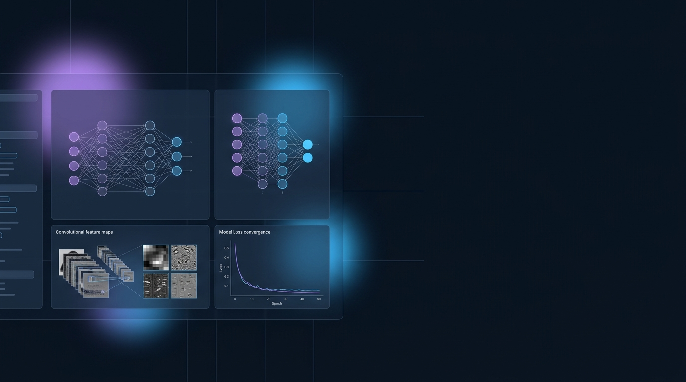

<div align="center">

  

  # Deep Learning & Neural Network Portfolio
  
  <p align="center" style="font-size: 1.15rem; color: #94A3B8;">
    Curated implementations of modern neural architectures: CNNs, GANs, RNNs, and Transfer Learning models.
  </p>

  <div>
    
    
    
    
    
  </div>

</div>

---

## ◈ Architectural Progression & Model Index

```
Foundational Models ➔ Multilayer Perceptrons & Regularization (Dropout, BatchNorm)
Computer Vision     ➔ Custom CNNs & Transfer Learning (ResNet-50, VGG-16)
Generative AI       ➔ Deep Convolutional GANs (DCGAN) & Synthetic Image Generation
Sequential Modeling ➔ RNNs, LSTMs & Sequence Attention for Time-Series Prediction
```

---

## ◈ Problem

Many modern deep learning tutorials present disconnected snippets that lack production engineering rigor:
1. **Unstable Training Dynamics:** Vanishing/exploding gradients, mode collapse in GANs, and overfitting on small data sets.
2. **Lack of Comparative Benchmarks:** Tutorials rarely benchmark convergence curves, memory footprints, and inference latency across frameworks.
3. **Reproducibility Deficit:** Missing random seeds, non-deterministic data loaders, and undocumented hyperparameter configurations.

---

## ◈ Solution

This portfolio provides clean, modular, and defensible deep learning pipelines implemented from mathematical foundations:
- **Systematic Architecture Breadth:** Comprehensive coverage of CNNs for image classification, DCGANs for generative synthesis, RNN/LSTM for sequence modeling, and pretrained transfer learning fine-tuning.
- **Engineered Training Loops:** Custom PyTorch training engines equipped with learning rate warmups, early stopping, model checkpointing, and gradient clipping.
- **Comparative Metrics & Logging:** Side-by-side performance analysis (loss curves, ROC-AUC, confusion matrices, and FLOPS/latency profiling).

---

## ◈ Key Modules

<table width="100%" border="0" cellpadding="0" cellspacing="0" style="border-collapse: separate; border-spacing: 12px;">
  <tr>
    <td width="33.33%" valign="top" style="background: #0D1726; border: 1px solid #1E293B; border-radius: 12px; padding: 18px;">
      <h4 style="color: #60A5FA; margin: 0 0 8px 0;">👁️ Vision &amp; CNNs</h4>
      <p style="color: #94A3B8; font-size: 0.88rem; line-height: 1.5; margin: 0;">
        From scratch convolutional architectures alongside fine-tuned ResNet and MobileNet backbones.
      </p>
    </td>
    <td width="33.33%" valign="top" style="background: #0D1726; border: 1px solid #1E293B; border-radius: 12px; padding: 18px;">
      <h4 style="color: #60A5FA; margin: 0 0 8px 0;">🎨 Generative Models</h4>
      <p style="color: #94A3B8; font-size: 0.88rem; line-height: 1.5; margin: 0;">
        Minimax DCGAN implementations with spectral normalization and Wasserstein loss stabilization.
      </p>
    </td>
    <td width="33.33%" valign="top" style="background: #0D1726; border: 1px solid #1E293B; border-radius: 12px; padding: 18px;">
      <h4 style="color: #60A5FA; margin: 0 0 8px 0;">⏱️ Sequence &amp; Time-Series</h4>
      <p style="color: #94A3B8; font-size: 0.88rem; line-height: 1.5; margin: 0;">
        Bidirectional LSTMs and GRUs for temporal sequence forecasting and sentiment classification.
      </p>
    </td>
  </tr>
</table>

---

## ◈ Tech Stack

- **Core Frameworks:** PyTorch, TensorFlow / Keras
- **Evaluation & Preprocessing:** Scikit-Learn, Albumentations, Matplotlib, Seaborn
- **Data Engineering:** NumPy, Pandas, HDF5
- **Tooling:** CUDA, TensorBoard, Jupyter Lab

---

## ◈ Quickstart & Usage

```bash
# 1. Clone repository
git clone https://github.com/GauriShinde911/deep-learning-portfolio.git
cd deep-learning-portfolio

# 2. Install dependencies
pip install -r requirements.txt

# 3. Train a vision classification model
python models/cnn_vision/train.py --dataset cifar10 --epochs 30

# 4. Train DCGAN generative synthesis
python models/gan_generative/train_dcgan.py --latent_dim 100 --epochs 50
```

---

## ◈ Future Roadmap

- [ ] Add Vision Transformer (ViT) implementation with attention rollout visualization.
- [ ] Integration of LoRA / QLoRA parameter-efficient fine-tuning for vision-language models.
- [ ] Quantization benchmarks (INT8 vs FP16) comparing latency and accuracy degradation.
- [ ] Automated TensorBoard and Weights & Biases experiment tracking pipelines.

---

## ◈ License & Author

Authored by **Gauri Shinde** (2026)  
MIT License
