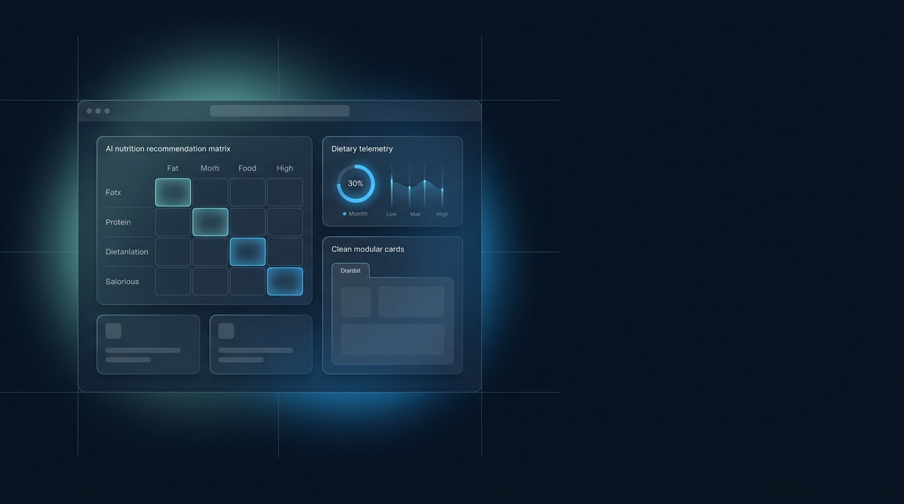

<!-- Production README Template for HomeBite -->
<div align="center">

  

  # HomeBite (Smart Tiffin & Personalized Nutrition Platform)
  
  <p align="center" style="font-size: 1.15rem; color: #94A3B8;">
    AI-assisted personalized nutrition and meal subscription platform with multi-factor recommendation and demand forecasting.
  </p>

  <div>
    
    
    
    
    
  </div>

</div>

---

> **Published Research:**  
> *"AI-Powered Personalized Nutrition and Home-Food Platform," World Journal of Innovative Research (WJIR), Vol. 20, Issue 4, pp. 35-41, April 2026. DOI: [10.31871/WJIR.20.4.15](https://doi.org/10.31871/WJIR.20.4.15)*

---

## ◈ Visual Overview & Live Experience

```
Customer Profile ➔ Dietary Tags (Vegetarian, Low-Sodium, Calorie Goal: 650 kcal)
Scoring Engine   ➔ Multi-Factor Weighting (Nutritional Match + Cook Distance + Taste History)
Order Placement  ➔ Automated Subscription Recurring Schedule
Kitchen Pipeline ➔ Demand-Forecasted Prep List (25% Food Waste Reduction)
Fulfillment      ➔ Leaflet Real-Time Rider Telemetry Map
```

---

## ◈ Problem

Daily meal subscription services face chronic operational and user retention pain points:
1. **Menu Monotony & Dietary Mismatch:** Generic static menus fail to adapt to subscriber fitness targets, allergies, or mood preferences, driving churn after 3–4 weeks.
2. **Predictive Food Waste:** Home-cooks and micro-kitchens struggle to forecast daily raw ingredient purchases, leading to severe ingredient spoilage and unpredictable margins.
3. **Logistics Opacity:** Traditional local tiffin services lack live route transparency and real-time delivery telemetry.

---

## ◈ Solution

**HomeBite** unifies AI recommendation algorithms with micro-kitchen logistics:
- **Multi-Factor Recommendation Engine:** Scores each dish based on calorie density, macronutrient breakdown, flavor preferences, and past ratings to deliver customized daily meal rotations.
- **Demand Forecasting Module:** Analyzes historical consumption trends and neighborhood order density to predict preparation quantities 24 hours in advance.
- **Full-Stack Cloud Infrastructure:** High-performance React 19 single-page app backed by Supabase for instantaneous authentication, PostgreSQL row-level security, and real-time order state updates.

---

## ◈ Architecture

<div align="center" style="margin: 24px 0;">
   Recommendation Engine -> Subscription Logic -> Supabase -> Live Tracking" />
</div>

1. **Client Interface:** Modern responsive frontend built with React 19, Vite, and TailwindCSS.
2. **Recommendation Engine:** Client/Edge heuristic scoring layer prioritizing nutritional compliance and allergy safety.
3. **Data & Auth Layer:** Supabase PostgreSQL with real-time websocket subscriptions and Row Level Security (RLS).
4. **Geolocation Service:** OpenStreetMap / Leaflet integration for interactive delivery tracking.

---

## ◈ Key Features

<table width="100%" border="0" cellpadding="0" cellspacing="0" style="border-collapse: separate; border-spacing: 12px;">
  <tr>
    <td width="33.33%" valign="top" style="background: #0D1726; border: 1px solid #1E293B; border-radius: 12px; padding: 18px;">
      <h4 style="color: #60A5FA; margin: 0 0 8px 0;">🥗 Personalized Nutrition</h4>
      <p style="color: #94A3B8; font-size: 0.88rem; line-height: 1.5; margin: 0;">
        Rule-based multi-factor scoring matching dietary constraints, caloric targets, and past order sentiment.
      </p>
    </td>
    <td width="33.33%" valign="top" style="background: #0D1726; border: 1px solid #1E293B; border-radius: 12px; padding: 18px;">
      <h4 style="color: #60A5FA; margin: 0 0 8px 0;">📉 Waste Reduction Engine</h4>
      <p style="color: #94A3B8; font-size: 0.88rem; line-height: 1.5; margin: 0;">
        Predictive batch forecasting reduces kitchen food waste by up to 25% through scheduled subscription locking.
      </p>
    </td>
    <td width="33.33%" valign="top" style="background: #0D1726; border: 1px solid #1E293B; border-radius: 12px; padding: 18px;">
      <h4 style="color: #60A5FA; margin: 0 0 8px 0;">📍 Live Telemetry Tracking</h4>
      <p style="color: #94A3B8; font-size: 0.88rem; line-height: 1.5; margin: 0;">
        Interactive Leaflet mapping with real-time route updates from kitchen dispatch to subscriber doorstep.
      </p>
    </td>
  </tr>
</table>

---

## ◈ Tech Stack

- **Frontend:** React 19, TypeScript, Vite, TailwindCSS, Lucide Icons
- **Backend & Database:** Supabase, PostgreSQL, Row Level Security (RLS)
- **Mapping & Geolocation:** Leaflet, OpenStreetMap
- **State Management:** React Context, Real-Time WebSockets

---

## ◈ Quickstart & Installation

```bash
# 1. Clone repository
git clone https://github.com/GauriShinde911/home-bite.git
cd home-bite

# 2. Install dependencies
npm install

# 3. Configure environment variables (.env)
VITE_SUPABASE_URL=your_supabase_project_url
VITE_SUPABASE_ANON_KEY=your_supabase_anon_key

# 4. Start development server
npm run dev
```

---

## ◈ Future Roadmap

- [ ] Automated nutritional macro computer vision scanner for home-cook meal photo verification.
- [ ] Integration with wearable health data (Apple Health / Google Fit) for dynamic calorie adjustments.
- [ ] Multi-tenant micro-kitchen dashboard with automated payout calculation.
- [ ] Offline-first mobile PWA caching for rural delivery riders.

---

## ◈ License & Citation

Published research under Creative Commons / WJIR.  
Codebase authored by **Gauri Shinde** (2026).
