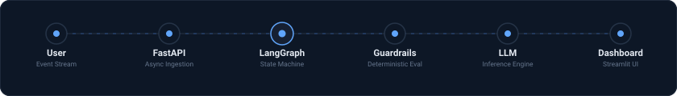

<!-- Production README Template for SEA Agent -->
<div align="center">

  

  # SEA Agent (Smart Event Analytics)
  
  <p align="center" style="font-size: 1.15rem; color: #94A3B8;">
    Autonomous decision intelligence agent with deterministic state graphs, runtime guardrails, and audit-verified reasoning.
  </p>

  <div>
    
    
    
    
    
  </div>

</div>

---

## ◈ Visual Overview & Live Interaction

```
User Query ➔ "Analyze all technical events from last semester and rank performing organizations."
Agent Plan ➔ Intent Extracted (Period: 2025-Q2, Category: Tech)
Tool Call  ➔ get_events() ➔ get_registrations() ➔ get_feedback()
Engine     ➔ Python Deterministic Metrics (Reach, Attendance Rate, Variance, Quality)
Validator  ➔ AST/Regex Grounding Check (Zero LLM Hallucinations Verified)
Output     ➔ Multi-Format Audit Report (.md / .docx / Streamlit Wallboard)
```

---

## ◈ Problem

Operational evaluation of recurring events, organizational programs, and student activities suffers from three critical bottlenecks:
1. **Unstructured Alert & Log Fatigue:** Aggregating attendance rosters, registration forms, and post-event feedback across multiple teams requires days of manual spreadsheet reconciliation.
2. **LLM Hallucination Risk:** Generative assistants frequently invent metrics, miscalculate percentage variances, or fabricate performance correlations when directly summarizing raw tables.
3. **Data Privacy & Compliance:** Sending raw student or participant PII directly into external model APIs violates security and data compliance policies.

---

## ◈ Solution

**SEA Agent** decouples mathematical computation from natural language reasoning:
- **Pure Deterministic Computing:** All metric aggregation (turnout stability, reach, execution variance, normalized composite scoring) is executed entirely by Python and pandas. **The LLM never calculates or sorts numbers.**
- **Zero-PII Abstraction:** Raw participant records remain protected in local SQLite storage; only pre-aggregated, anonymized summary schemas are provided to the LLM.
- **Runtime Grounding Validator:** A programmatic AST and regex post-processing filter inspects every number generated in the explanation against source ground truth tables before returning output.

---

## ◈ Architecture

<div align="center" style="margin: 24px 0;">
   FastAPI -> LangGraph -> Guardrails -> LLM -> Analytics Dashboard" />
</div>

1. **Ingestion Layer:** Asynchronous request dispatching via FastAPI with schema validation.
2. **State Graph Layer:** Directed cyclic graph orchestrated with LangGraph for multi-turn intent resolution and clarification loops.
3. **Deterministic Core:** Pandas computation modules executing min-max normalization against inspectable weights (`weights_config.json`).
4. **Safety & Audit Layer:** Runtime policy guardrails, AST numerical verification, and Word/Markdown audit export.

---

## ◈ Key Features

<table width="100%" border="0" cellpadding="0" cellspacing="0" style="border-collapse: separate; border-spacing: 12px;">
  <tr>
    <td width="33.33%" valign="top" style="background: #0D1726; border: 1px solid #1E293B; border-radius: 12px; padding: 18px;">
      <h4 style="color: #60A5FA; margin: 0 0 8px 0;">⚡ Autonomous Tool Calling</h4>
      <p style="color: #94A3B8; font-size: 0.88rem; line-height: 1.5; margin: 0;">
        Dynamically calls SQLite data loaders with clarifying question fallbacks if parameters are underspecified.
      </p>
    </td>
    <td width="33.33%" valign="top" style="background: #0D1726; border: 1px solid #1E293B; border-radius: 12px; padding: 18px;">
      <h4 style="color: #60A5FA; margin: 0 0 8px 0;">🛡️ Hallucination Guardrails</h4>
      <p style="color: #94A3B8; font-size: 0.88rem; line-height: 1.5; margin: 0;">
        Programmatic verification guarantees 100% numerical fidelity between generated text and computed tables.
      </p>
    </td>
    <td width="33.33%" valign="top" style="background: #0D1726; border: 1px solid #1E293B; border-radius: 12px; padding: 18px;">
      <h4 style="color: #60A5FA; margin: 0 0 8px 0;">📊 Transparent Scoring</h4>
      <p style="color: #94A3B8; font-size: 0.88rem; line-height: 1.5; margin: 0;">
        Adjustable 0–100 composite ranking scores with explicit handling of missing surveys and partial rosters.
      </p>
    </td>
  </tr>
</table>

---

## ◈ Tech Stack

- **Core & Backend:** Python 3.11, FastAPI, SQLite3 (Foreign Keys enforced)
- **Agent Orchestration:** LangGraph, Native Tool-Calling Protocol
- **Evaluation & Security:** AST Syntax Inspection, Regex Numerical Validator, Pydantic Schema Guards
- **Frontend & Reporting:** Streamlit, ReportLab, python-docx

---

## ◈ Quickstart & Installation

```bash
# 1. Clone repository
git clone https://github.com/GauriShinde911/smart-event-analytics-agent.git
cd smart-event-analytics-agent

# 2. Setup virtual environment & dependencies
python -m venv venv
source venv/bin/activate  # Windows: .\venv\Scripts\activate
pip install -r requirements.txt

# 3. Run verification test suite
pytest tests/

# 4. Launch interactive dashboard
streamlit run app.py
```

---

## ◈ Future Roadmap

- [ ] Automated regression testing via synthetic event test harnesses (`ragas` / `deepeval`).
- [ ] Direct telemetry connector for enterprise Kafka / webhook ingestion streams.
- [ ] Multi-organization role-based access control (RBAC) with partition auditing.
- [ ] Exportable interactive executive slide deck generation.

---

## ◈ License & Author

Developed by **Gauri Shinde**  
MIT License • 2026
